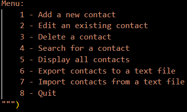

# Contact Management System Application

**This is an application that allows users to create and store contacts using an interactive menu**

## _"Welcome to the Contact Management System!"_

The user chooses a number from the menu to start the application off and followed up with questions depending on the choices they make
-For instance, choosing to add a contact will follow with questions asking what the first and last name of the contact they want to add to start.
- You then have to add in a valid phone number, email and if you want to add additional information about the contact you can as well

**When the user fully goes through a function within the program, they will be sent back to the main menu. If the user would like to end the program they can simple type in "8" and that will exit the application **

This application fully checks for valid email addresses and phone numbers in a specific format with instruction.

The user has the ability to import and extract contacts as well!
